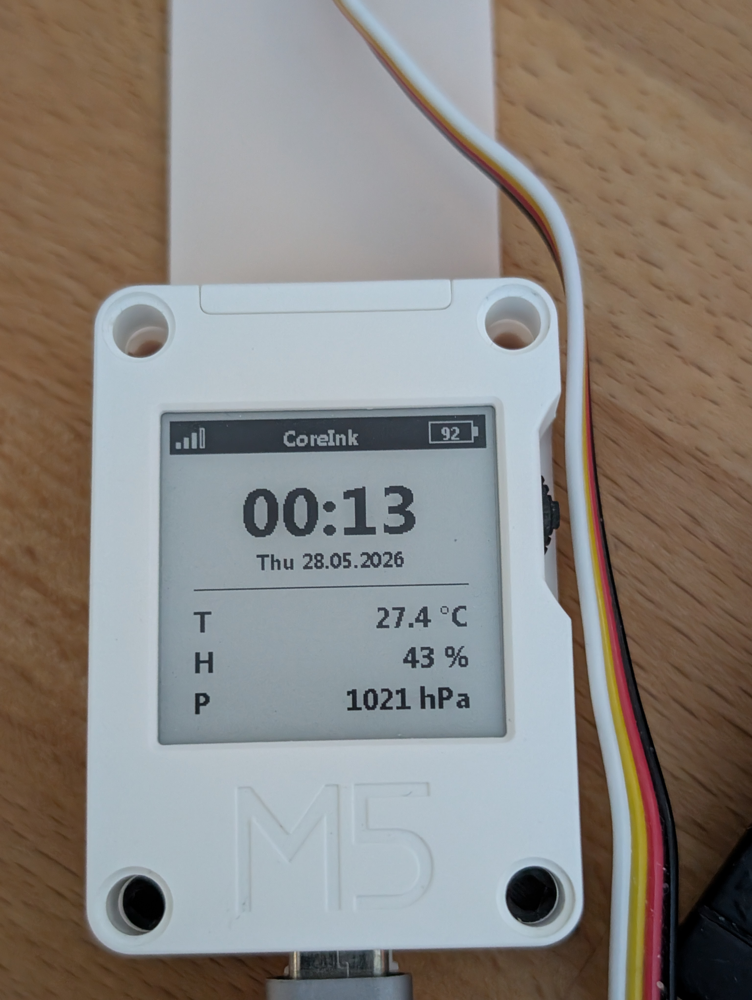

# M5Stack CoreInk — ESPHome Demo

An ESPHome configuration for the **M5Stack CoreInk** that turns the device into
a compact air-quality monitor with a 1.54 " e-paper display.  It reads
temperature, humidity, barometric pressure and IAQ from a **BME688** sensor
attached via the Grove Port-A connector and publishes everything to
**Home Assistant**.


---

## Hardware

| Component | Notes |
|---|---|
| [M5Stack CoreInk](https://docs.m5stack.com/en/core/coreink) | ESP32-based, built-in 1.54 " e-paper, PCF8563 RTC, buzzer, rotary encoder |
| [M5Stack ENV Pro (BME688)](https://docs.m5stack.com/en/unit/envpro) | Temperature · Humidity · Pressure · Gas resistance |
| Grove cable | Connects ENV Pro to Port-A (GPIO32/33) |
| LiPo battery (optional) | Measured on GPIO35 via 1:4.25 voltage divider |

### Pin summary

| Signal | GPIO |
|---|---|
| SPI CLK | 18 |
| SPI MOSI | 23 |
| SPI MISO | 34 |
| E-paper CS | 9 |
| E-paper DC | 15 |
| E-paper RESET | 0 |
| E-paper BUSY | 4 |
| I2C SDA (internal) | 21 |
| I2C SCL (internal) | 22 |
| I2C SDA (Port-A) | 32 |
| I2C SCL (Port-A) | 33 |
| Buzzer (LEDC) | 2 |
| External LED | 10 |
| Battery ADC | 35 |
| Power-hold MOSFET | 12 |
| Rotary up | 37 |
| Rotary press | 38 |
| Rotary down | 39 |
| Button top | 5 |
| Button side | 27 |

---

## Display layout

```
┌──────────────────────────────┐
│▁▃▆█  CoreInk        [87 ]+  │  ← status bar (inverted)
│                              │
│           14:32              │  ← time (HH:MM)
│       Mon 27.05.2026         │  ← date
│  ──────────────────────────  │
│  T                 23.4 °C   │
│  H                   52 %    │
│  P               1013 hPa    │
└──────────────────────────────┘
```

- **Status bar**: WiFi signal bars (left) · device name · battery % (right)
- **Clock / date**: SNTP time; falls back to hardware RTC when offline
- **Sensor rows**: Temperature · Humidity · Pressure from the BME688

---

## Features

- **BME688** air-quality sensing via Bosch BSEC2 library (LP sample rate)
- **Composite IAQ index** with qualitative labels (Excellent → Extremely polluted)
- **E-paper** refresh every 60 s with full update on every frame
- **Battery monitoring**: ADC with piecewise voltage→percent calibration
- **Hardware RTC** (PCF8563) disciplined by SNTP; survives WiFi loss
- **Buzzer** with RTTTL support — 7 pre-built melodies + custom song service
- **Power-hold** MOSFET control to cut power cleanly
- **Web server** for local status page
- **HA API** services for remote melody playback
- **Wakeup-cause** diagnostic sensor

---

## Prerequisites

- [ESPHome](https://esphome.io) ≥ 2024.x (BSEC2 support required)
- Home Assistant (optional, but assumed for `binary_sensor.personen_zuhause`)
- A copy of `segoeuithibd.ttf` in the `fonts/` folder — see [`fonts/README.md`](fonts/README.md)

---

## Quick start

### 1 · Clone the repo

```bash
git clone https://github.com/3djupp/m5core-ink-esphome-demo.git
cd m5core-ink-esphome-demo
```

### 2 · Create your secrets file

```bash
cp secrets.yaml.example secrets.yaml
# Edit secrets.yaml and add your WiFi credentials
```

### 3 · Add the font

Place `segoeuithibd.ttf` into the `fonts/` directory (see `fonts/README.md` for
alternatives).

### 4 · Adjust substitutions

Open `coreink.yaml` and update the top `substitutions:` block:

| Key | What to change |
|---|---|
| `name` / `hostname` / `friendly_name` | Your device identifiers |
| `encryption_key` | Run `esphome generate-encryption-key` |
| `ota_encryption_key` | Your OTA password |
| `ap_fallback_pw` | Fallback AP password |
| `time_timezone` | Your POSIX timezone string |
| `epaper.type` + `epaper.busy.inverted` | See comment in the file |

#### E-paper hardware variant

Two CoreInk display variants exist:

| Variant | `epaper.type` | `epaper.busy.inverted` |
|---|---|---|
| Default (most units) | `1.54inv2` | `false` |
| Older M09 revision | `1.54in-m5coreink-m09` | `true` |

### 5 · Flash

**First flash** (USB cable required):

```bash
esphome run coreink.yaml
```

**Subsequent updates** (OTA):

```bash
esphome run coreink.yaml --device <ip-address>
```

---

## Home Assistant services

Once the device is adopted by HA, the following services are available under
`esphome.<device_name>_*`:

| Service | Description |
|---|---|
| `play_rtttl` | Play any RTTTL string (`song_str` variable) |
| `play_missionimp` | Play the Mission Impossible theme |
| `play_twoshortbeeps` | 2 short beeps |
| `play_threeshortbeeps` | 3 short beeps |
| `play_fourshortbeeps` | 4 short beeps |
| `play_fiveshortbeeps` | 5 short beeps |
| `play_sixshortbeeps` | 6 short beeps |

---

## Customisation tips

### Change the presence sensor

The config mirrors `binary_sensor.personen_zuhause` from HA for future presence-
aware logic.  Replace the `entity_id` in the `binary_sensor` section to match
your own entity.

### Add more sensor rows

Extend the `lambda:` block in the `display:` section.  The display is 200×200 px.
The current layout leaves the bottom ~30 px unused.

### Adjust battery calibration

The `calibrate_linear` datapoints in `${name}_bat_pct` are measured on a
specific LiPo.  Re-calibrate for your cell by logging `${name}_bat_adc` raw
values at known charge states.

---

## Project structure

```
m5core-ink-esphome-demo/
├── coreink.yaml          # Main ESPHome configuration
├── secrets.yaml.example  # WiFi credential template
├── .gitignore
├── LICENSE               # GPL-2.0
├── fonts/
│   └── README.md         # Font requirements & alternatives
└── README.md
```

---

## License

GPL-2.0 — see [LICENSE](LICENSE).
